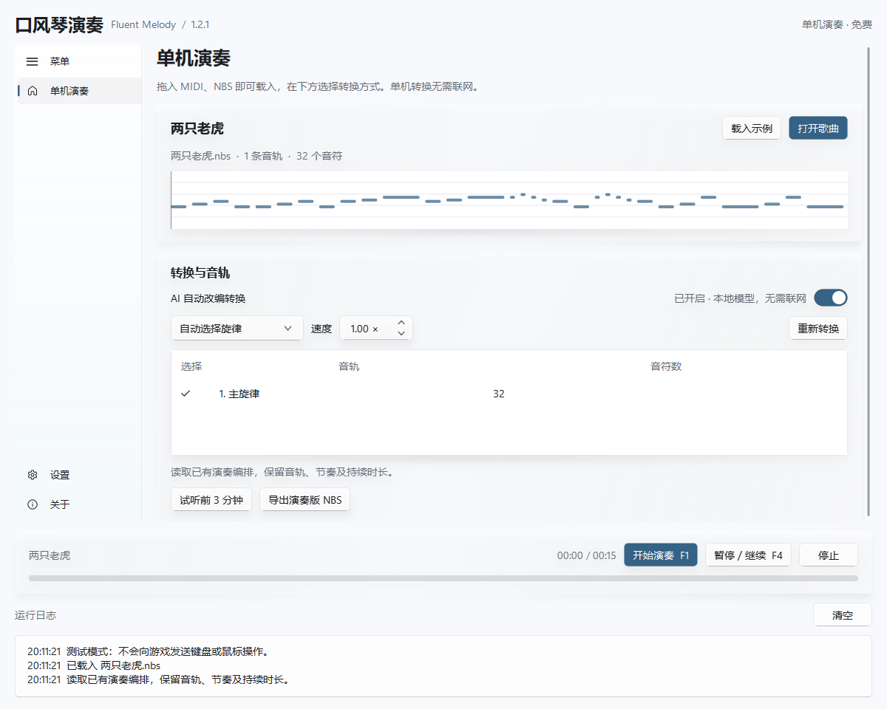

# 口风琴演奏 · Fluent Melody 1.2.1

Windows 口风琴演奏工具，界面使用自研的 [FluentPy](https://github.com/XDDXMT/FluentPy)。默认显示免费的单机演奏；多人合奏和 AI 编曲可在设置中开启 Beta 模式后使用。

**客户端、多人合奏服务器、AI 编曲服务器均已开源，任何人都可以自行搭建。** 客户端可连接自己配置的服务器，不绑定作者的服务，也不需要向作者购买部署授权。

制作作者：性邓的小馒头

歌曲卡片中的音符预览使用自研 FluentPy 的正式控件 [NoteTimeline](https://github.com/XDDXMT/FluentPy/blob/main/docs/note-timeline.md)，支持分轨显示与播放游标，可在其他 Qt 项目中独立使用。



## 开源与许可

项目源码（包括两种服务端及 token 管理工具）采用 [MIT 许可](LICENSE)。自研 UI 库已独立开源至 [XDDXMT/FluentPy](https://github.com/XDDXMT/FluentPy)，同样采用 [MIT 许可](licenses/FluentPy-LICENSE.txt)；本库保留[配套源码副本](fluentpy/)，可以直接运行。接入改动见 [FluentPy 改动说明](FluentPy改动说明.md)。第三方图标、模型与运行依赖保留各自的许可，详见 [第三方声明](licenses/THIRD_PARTY_NOTICES.md)。

仓库包含客户端、两种服务端、离线模型、演示歌曲和测试。不包含用户导入的歌曲、设备凭据、已发行 token、数据库或付费 API 密钥。示例配置 `ai.example.json` 默认不连接编曲提供方；本地转换可以直接使用。

| 源码 | 内容 |
| --- | --- |
| [客户端](fluentmelody/client/) | 单机演奏、主界面和服务器连接 |
| [多人合奏服务器](fluentmelody/servers/multiplayer.py) | 房间、乐谱分配、统一起奏和断线暂停 |
| [AI 编曲服务器](fluentmelody/servers/ai.py) | 编曲任务、提供方接入和额度管理 |
| [token 管理工具](fluentmelody/servers/admin.py) | 自行发行、查询和停用本服务器的 token |
| [FluentPy 独立仓库](https://github.com/XDDXMT/FluentPy) | 自研 UI 库、组件示例与测试；[本项目配套副本](fluentpy/) |

## 先试单机

1. 解压完整发布包，运行 `FluentMelody/FluentMelody.exe`。不要只复制 exe，旁边的 `_internal` 文件夹也需要保留。
2. 点击「载入示例」，或打开自己的 MIDI / NBS 文件。也可把 `.mid`、`.midi`、`.nbs` 文件拖进窗口，直接回到单机页面载入并自动转换；也可勾选指定音轨或合并全部音轨。
3. 游戏内打开口风琴。按 F1 后有 3 秒切回游戏；再次 F1 停止，F4 暂停/继续。界面的停止按钮也可立即松开演奏按键。
4. 「试听前 3 分钟」使用本机合成音色，不发送游戏按键。「导出演奏版 NBS」保存转换结果。

键位为 `Z X C V B N M ,`。鼠标左键低音、右键高音、中键半音；左键与中键一起按是低音半音，右键与中键一起按是高音半音，左右键不会同时按。每个人同时仍只按一个音符键，松开上一个键后至少等 0.1 秒。

转换支持 MIDI 48–85（C3 至 C♯6），会尽量保留可演奏音域内的原音高，低音和高音区的半音不再因缺少组合键映射而折回普通音区。升级前已载入的歌曲需重新转换；已导出的旧演奏版建议从原始 MIDI / NBS 重新载入转换，才能恢复此前折叠的音高。困难片段仍会自动简化；普通 NBS 本身没有持续时长，程序按相邻音符推定。本程序导出的 NBS 带有持续时长扩展，可以重新读取。

客户端需要与游戏处于相同权限级别，发布的 exe 会请求管理员权限。游戏的实际按键接受情况仍需在你的电脑内试奏；本次自动测试没有向游戏发送按键。

拖入歌曲不会自动播放或上传。一次拖入多个文件时，只载入其中第一个支持的本地歌曲文件；已加入多人房间时，需先退出房间再换本地歌曲。窗口内的日志、输入框等区域也可接收歌曲拖放。Windows 管理员权限下另有原生文件拖放支持，但从资源管理器向实际提升权限的程序拖入，仍需在你的电脑上确认；无法拖入时可使用「打开歌曲」。

## 本地自动转换

主界面「单机演奏 → 转换与音轨」提供 **AI 自动改编转换** 开关，默认开启，即时保存并在下次启动时恢复。开启使用本地模型辅助选择旋律；关闭使用普通音轨与乐句规则，不调用模型。两种方式都遵守单音、音域和至少 0.1 秒松键间隔。

切换后会停止当前单机演奏，并重新转换已载入的歌曲，不自动开始播放。转换中再次切换会等当前任务结束后按最后一次选择重新转换，旧结果不会覆盖新选择。这个开关始终在主界面，与设置中的 Beta 模式独立；多人房间内修改仅影响以后单机转换。

载入原始歌曲后，默认使用内置的离线旋律识别模型，再结合音轨特征、乐句休止、重复同音和节拍选择单音旋律。前奏、间奏和尾奏会结合器乐声部处理，不只保留人声段。MIDI 的实际按键时长与延音踏板残响分别记录，避免把伴奏的长残响误当成长旋律音。

内置模型采用 ISMIR 2019 论文作者公开的 POP 卷积神经网络权重，文件为 **874,991 字节**。程序使用 NumPy 在本机推理，不需要联网、API 密钥、token 或额外下载，也不依赖 PyTorch、TensorFlow 或 ONNX Runtime。模型是作者公开的第三方成果，保留 MIT 许可；本程序负责接入和编排规则，未将其作为自行训练的模型。详见 **本地旋律识别说明.md**。

输出仍遵守单音与至少 0.1 秒松键间隔。临近可演奏间距的片段可小幅调整起音，单音调整最多 50 毫秒，整曲不累积延迟；仍然过密时会减速或删减。模型分数只是选择依据，不能保证每首歌都与原曲旋律完全一致；可以试听后改选音轨。

本程序已编排且声部数匹配的 NBS 会优先保留原有音轨、节奏和时长。想用新版重新识别，请载入原始 MIDI / NBS，而不是已导出的演奏版。模型文件缺失、损坏或运行异常时，程序会明确提示，并回退到音轨与乐句规则。

本地识别默认可用，不消耗服务器额度。Beta 模式中的「AI 编曲」是另一项服务器功能，需要配置服务和兑换对应 token。

## 修改快捷键

进入「设置」，最上方是「快捷键」。点击对应输入框，直接按下希望使用的键或组合键，再点「应用快捷键」。例如将开始／准备改为 `F8`，暂停／继续改为 `Ctrl+Alt+P`。保存后立即生效，重新打开程序仍会保留；「恢复默认」恢复 `F1` 和 `F4`。

两个操作不能使用同一组键。录入期间暂停全局监听，Esc 取消录入，Tab 切换输入框；演奏中需先停止再修改。被其他程序占用的组合会提示冲突并保留原设置。`Z X C V B N M ,` 是演奏键，不能作为控制快捷键，`F12` 和部分系统组合也不能使用。

下文提到的 F1、F4 是默认设置；修改后，单机和多人模式都使用你保存的按键。每位成员可以各自设置，房主的暂停／继续键控制全房间。

## 开启 Beta 模式

进入「设置 → 实验功能」，打开「Beta 模式」，侧栏即显示「多人合奏」「AI 编曲」，设置中也会显示对应的服务器连接选项。开关保存在本机，重新打开程序后保留；旧版设置首次升级时默认关闭。

关闭 Beta 模式会隐藏这些入口。有房间或正在发出的连接、提交请求时，先退出房间或等待请求完成，再关闭开关。已经提交的 AI 编曲任务会保留，关闭后暂停本机查询，重新开启时恢复查询；服务端已开始的编曲仍会继续，关闭开关不等于取消任务。单机演奏不需要开启 Beta 模式。

## 自行搭建服务器

两种服务器可以独立部署，只需要多人合奏时无需启动 AI 服务。自建者自行管理数据库和 token，可以免费发放，也可以自行决定服务价格；程序不接入支付平台，不向作者请求发码或验证授权。调用第三方 AI 的账户、API 密钥与费用由自建者负责。

以下以 Windows PowerShell、Python 3.13 为例。只搭服务器时安装 `requirements-server.txt`，无需安装桌面 UI 依赖。已经克隆仓库可跳过前两行：

```powershell
git clone https://github.com/XDDXMT/FluentMelody.git
cd FluentMelody
python -m venv .venv
.\.venv\Scripts\python.exe -m pip install -r requirements-server.txt
```

**启动多人合奏服务器：**

```powershell
.\.venv\Scripts\python.exe -m fluentmelody.servers.multiplayer --db data/multiplayer.sqlite3 --host 127.0.0.1 --port 8765
```

**可选：在另一个终端启动 AI 编曲服务器。** 先复制一次示例配置，再编辑自己的 `ai.json`：

```powershell
Copy-Item ai.example.json ai.json
.\.venv\Scripts\python.exe -m fluentmelody.servers.ai --config ai.json
```

默认 `backend` 为 `unconfigured`，服务可以启动，但不会接收编曲任务或扣除额度。要使用编曲，按 [AI 服务器说明](AI服务器说明.md) 配置自建者自己的提供方，再重启 AI 服务。请保留两份独立数据库：联机使用 `data/multiplayer.sqlite3`，AI 使用 `data/ai.sqlite3`，不能混用。

客户端开启「设置 → Beta 模式」后，在设置中填写对应服务器地址。本机测试分别使用 `http://127.0.0.1:8765` 和 `http://127.0.0.1:8766`。让局域网其他人连接时，联机启动参数改为 `--host 0.0.0.0`；AI 的 `ai.json` 中把 `host` 改为 `0.0.0.0`，客户端填写服务器实际的局域网 IP，不能填写 `0.0.0.0`。公网使用 HTTPS 反向代理地址。

已有 Windows 发布包时，也可以使用 `FluentMelodyServer.exe multiplayer ...`、`FluentMelodyServer.exe ai --config ai.json`，参数与上面的模块命令对应。更完整的运行与管理说明见 [服务器与 token 说明](服务器与token说明.md)。

## 获取与兑换 token

token 是自建服务器发放的访问凭据与时长／额度，不是向本项目购买的软件授权。保持服务运行，在另一个终端进入同一仓库目录执行：

```powershell
# 生成 10 个一天的联机 token，保存在已忽略的 data 目录
.\.venv\Scripts\python.exe -m fluentmelody.servers.admin --db data/multiplayer.sqlite3 --kind multiplayer issue --days 1 --count 10 --output data/tokens-001.txt
# 生成一个含 20 次额度的 AI token
.\.venv\Scripts\python.exe -m fluentmelody.servers.admin --db data/ai.sqlite3 --kind ai issue --credits 20 --count 1
```

明文 token 只在生成时输出或写入指定文件，`--output` 不覆盖已有文件。发码命令必须指向正在运行的服务所用的同一数据库；如果在 AI 配置中改了数据库路径，也要同步修改发码参数。用户在客户端填写该服务器地址，再在「多人合奏」或「AI 编曲」对应页面兑换。各自搭建的服务器分别发码和记账，token 不能跨服务器通用。

每位成员需要各自的联机 token，可由自建者免费发放。首次兑换立即开始按自然时间倒计时，离线和暂停同样计时。首次兑换绑定本机设备密钥；原设备重新兑换同一码只恢复登录，不重复增加时长，另一设备不能兑换。新 token 的时长接在已有余额后；余额耗尽时从本次兑换时刻开始。

设备密钥和登录凭据由 Windows DPAPI 保护，保存在 `%LOCALAPPDATA%/FluentMelody/device.dat`。换电脑或重装系统不是可直接迁移的授权场景。该方案是设备凭据绑定，不声称能抵御拥有系统控制权的人修改开源客户端。

## 多人合奏

1. 每个人开启 Beta 模式，在设置保存相同联机服务器地址，并兑换自己的联机 token。
2. 一人创建房间，把六位连接码交给其他成员；成员输入连接码加入。
3. 房主「上传歌曲」，服务端根据人数分配声部。已有本程序编排且声部数一致的 NBS 会保留原声部。
4. 每人 F1 准备，全部准备后统一 3 秒倒计时。房主 F4 暂停/继续全房间；房主停止后所有人重新准备。
5. 成员掉线会提示房主并暂停。连接恢复后保持暂停，由房主明确继续。成员退出后会重新分配声部，需要重新准备。

客户端通过往返时间估算服务器时钟，用未来时间戳同步起奏。同步并不等同于声卡级精确采样同步；局域网应先试奏，公网高延迟会影响效果。本机超过 1.8 秒收不到状态会停止按键，服务端按心跳处理全房间掉线。过时响应不能恢复已暂停的演奏。

## AI 编曲

开启 Beta 模式并进入「AI 编曲」，打开歌曲，选择人数，写简短的音乐要求，提交任务。完成后下载 NBS。AI 会选择音轨、调整各段声部与音高、简化过密音，并可补写短段音符；原曲完整时间线由本地音乐引擎处理，避免长曲被截成几段。

服务端独立管理 AI 额度，默认每次编曲或修改消耗 1 份，失败退还。每首默认最多修改 3 次，可由管理员设置。请求有长度、文件大小、并发、日额度、时间和输出大小限制。模型只返回通过校验的音乐数据，不执行模型生成的 Python 或命令。

## 部署到其他电脑

把发布包中的服务端、配置及说明复制过去即可，无需安装 Python。公网使用 HTTPS 反向代理，内网可使用 HTTP IP 地址。联机服务和 AI 服务使用不同端口、不同数据库，均以单进程方式启动；AI 服务内部已有受限任务并发。`data` 数据库应定期备份，不能放进公开下载目录。

详见 **服务器与token说明.md**、**AI服务器说明.md**。服务端没有公网管理接口，发行或停用 token 在服务器本机执行。

## 源码与构建

开发验证环境为 Windows / Python 3.13。源码目录附带 FluentPy，无需另外安装同名 UI 库。建议在独立虚拟环境中运行：

```powershell
git clone https://github.com/XDDXMT/FluentMelody.git
cd FluentMelody
python -m venv .venv
.\.venv\Scripts\Activate.ps1
python -m pip install -r requirements.txt
python 启动客户端.py
# 仅服务端需要的环境
python -m pip install -r requirements-server.txt
python 服务器.py multiplayer --db data/multiplayer.sqlite3
# 测试不会发送真实游戏按键
python -m unittest discover -s tests -v
# 打包 Windows 版本
python -m pip install pyinstaller
python build_release.py
```

构建中间文件保存在仓库内的 `build/pyinstaller`，成品位于 `release-<版本号>`；两者均被 Git 忽略。仓库源码直接运行即可，EXE 构建目录不提交到源码历史。

中文文件名和文本统一使用 **UTF-8**；Python、Markdown、JSON 等使用 LF 换行，Windows 批处理使用 CRLF。修改时请保留 UTF-8 编码，不要使用系统默认 ANSI / GBK 重新保存。`.editorconfig` 和 `.gitattributes` 已记录这些约定。

提交前可运行 `python tools/check_encoding.py --staged` 检查暂存区中的文本编码、乱码替换字符和换行。

`python 启动客户端.py --dry-run` 为无按键测试模式。服务器 AI 流程测试使用受控假模型；客户端的本地旋律识别使用随包附带的真实训练权重。服务器未配置提供方时会明确提示，正常程序没有把固定转换冒充服务器 AI 的后备模式。

## 界面与更新

默认浅色、蓝灰色，支持深色。保留 FluentPy 控件的形状、动画和操作；库内修复了销毁控件的主题订阅、自动关闭提示的释放，并补充可配置的导航宽度和导航入口显隐功能。

「关于」页面注明制作作者与 UI 库来源。FluentPy 是自研、采用 MIT 许可的 Qt Python UI 库，是独立实现，并非其他同类 GPLv3 组件库的分支、封装或换皮。底层 Qt / PySide6 和 Microsoft Fluent System Icons 仍分别遵循各自的许可；FluentPy 的 MIT 许可不替代第三方许可。发布包中的 `licenses` 目录保留相关声明。

更新清单可在设置填写 HTTPS 地址。配置后启动时自动检查并提示；用户点击后打开发布页，不自动执行远程程序或覆盖正在运行的客户端。清单格式：

```json
{"version":"1.0.1","url":"https://your-domain.example/releases/1.0.1","notes":"此处填写版本说明"}
```

本次已经测试本地协议、转换及无按键播放时序。真实 API/Codex 编曲和跨电脑游戏合奏需要使用你的服务配置完成实测；发布包不包含任何现成的付费 API 密钥或账户凭据。
